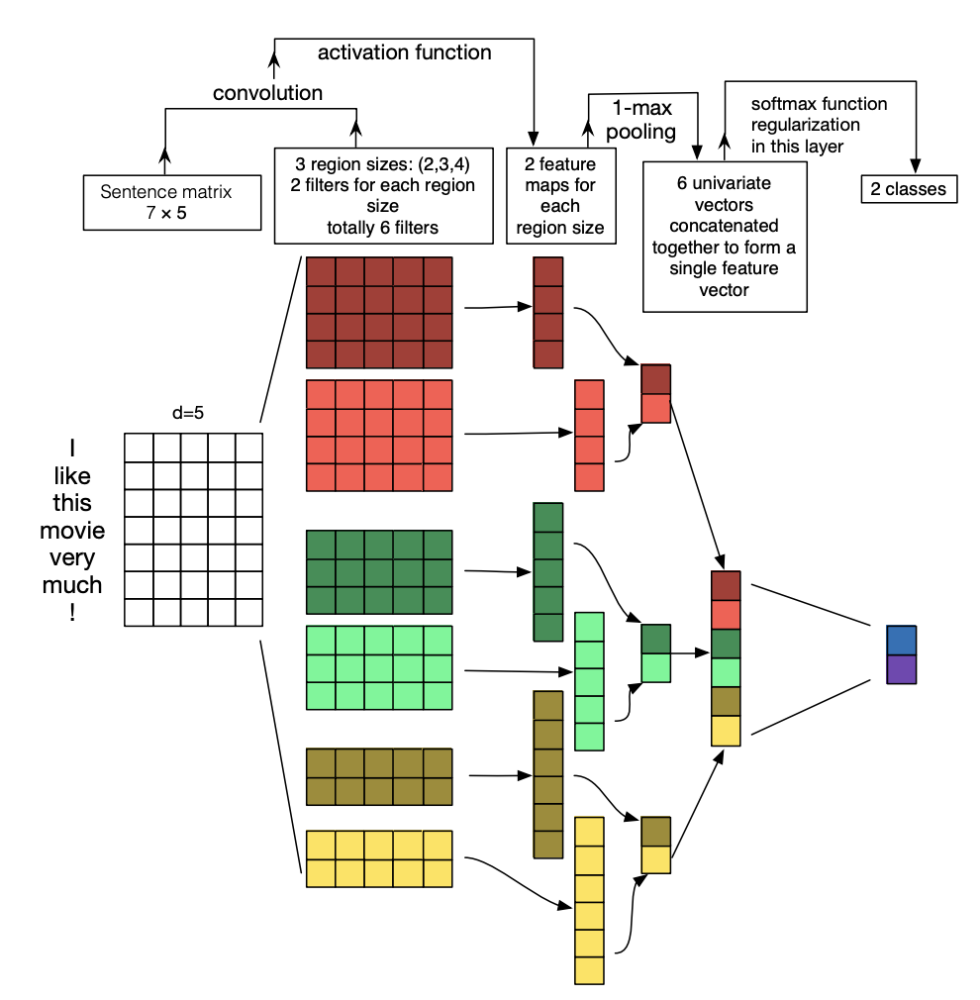

# CNN Hyperparameter Tuning and POS Embedding Experiments using ASAP AES Data

This is a project implementating hyperparameter tuning for Convolutional Neural Networks trained for automated essay
scoring in TensorFlow. It also explores the use of embeddings for part-of-speech (POS) tag embeddings along with word embeddings as
input to the neural network. The dataset used is the [ASAP AES dataset](https://www.kaggle.com/c/asap-aes).

## What is the ASAP AES dataset?

Automated essay scorers are used by a number of testing services in order to reduce the dependency on human resources in
the grading process. Standardized tests, which are taken by large numbers of people and tend to have a predetermined and
consistent format are especially suitable for this type of technology.

The Automated Student Assessment Prize (ASAP) Automated Essay Scoring (AES) dataset is a large set of graded essays that
was uploaded onto the predictive modeling and analytics platform Kaggle by the William Flora Hewlett Foundation in 2012
as part of a competition to find the best automated scoring algorithm.

The data consists of eight essay sets with between 1000–3000 essays in each set, and the rubrics for grading the essays.
Each essay is about 100–550 words long. The data for each essay set consists of the essays themselves, one or more
scores for each essay (the score ranges are different across the essay sets) and a resolved score if there is more than
one score. This is the data that will be used to train this neural network.

The input data for this network is vectorized representations of each essay, and the predicted output for each sample is
an essay score.

## What is the model architecture and what kind of hyperparameters are tuned?

This baseline and hyperparameter analysis is based on the 2016 paper by Zhang and Wallace: [A Sensitivity Analysis of 
(and Practitioners’ Guide to) Convolutional Neural Networks for Sentence Classification](https://arxiv.org/pdf/1510.03820.pdf)
. This paper explores the effect of architecture components like filter region size, activation function and pooling
strategy on model performance.

The model architecture is adapted from the paper and is as follows: the GLoVe-embedded essays are fed into three conv
layers of filter size regions 2, 3 and 4 with 5 filters for each region size. After each of these three layers, relu
activation and then 1-max-pooling are applied. The three outputs are then concatenated and fed into a dense layer with
sigmoid activation for the output. The filter size regions and number of filters are varied in this analysis.



In this analysis, the following hyperparameters are tuned:

* `--n-filters`, the number of filters/neurons in each convolution layer: 5, 10, 20, 30, 50, 70, 100
* `--filter-size-1`, `--filter-size-2` and `--filter-size-3` representing filter region sizes, the size of the feature
  maps produced i.e. the number of words we will slide over at a time (since this is an NLP task we will not specify a
  width for this dimension as in Computer Vision, since we do not want to convolve along the embedding dimension) we
  will have 3 per experiment: (2,3,4), (4,5,6), (7,8,9), (14,15,16) and (3,3,3)
* `Dropout`, the dropout rate applied after pooling and before the final dense layer: 0.1, 0.2, 0.3, 0.4, 0.5, 0.6, 0.7,
  0.8, 0.9
* `Learning Power`, the learning rate for the neural network: x = 3, 4, 5, 6 where x is exponent in learning_rate
  1\*10<sup>x</sup>
* `Initializer type`, the distribution with which to initialize the part-of-speech embedding matrix: random-normal,
  he-normal, xavier,

Model performance is recorded as the averages of macro-recall score, accuracy and QWK over 50 runs for each setting.

The training data is found at `data/training_data.csv`

## What are the models available?

Along with word embeddings, one of the goals of this project was to implement part-of-speech tag embeddings, discussed
in [Part-Of-Speech Tag Embedding for Modeling Sentences and Documents](https://escholarship.org/uc/item/0vk28220) by
Dong Jin Yu, 2016. The idea is that POS tags, like words, can be embedded into a continuous, high-dimensional space.
This could help the model to learn the syntactic features of text better.

The `--model-type`s available are:

* `shallow`, a "shallow" CNN where the outputs of three conv2D + 1-max-pooling layers are concatenated, followed by a
  dropout layer and a dense layer
* `deep`, a "deep" CNN where the three conv2D + 1-max-pooling layers are stacked in succession, so the input goes
  through them one by one and is then followed by a dropout layer and a dense layer; if `--model-type deep` is used
  with `--n-channels 2` instead of `--n-channels 1`, POS embeddings will be initialized as a second "channel" in the
  input matrix

## How do I run it?

To run,

1) Download the GloVe embedding files `glove.6B.50d.txt` and `glove.6B.300d.txt` from the GitHub releases for this repo. 
   These files can be put in the `data` directory.

2) Build docker image `cnn_pos_image` from Dockerfile:
```
docker build -t cnn_pos_image . 
```

3) Run the docker image as a container using:
```
docker run -it --runtime=nvidia -v $PWD:/data cnn_pos_image
```

Run it without the `--runtime` parameter if nvidia is not available in the environment.

4) Run the `train_cnn.py` script to train for a given set out of sets 1–8:
```
python3 train_cnn.py --data-path data/training_data.csv --model-type deep --embedding-path data/glove.6B.50d.txt --embedding-size 50 --train-overall --set-no 1 --n-runs 50 --n-filters 5 --n-epochs 150 --dropout-rate 0.6 --n-channels 2 --learning-power 4 --experiment 13 --initializer-type xavier
```

The `--embedding-size` should correspond to the `--embedding-path` selected, i.e. either `glove.6B.50d.txt`
or `glove.6B.300d.txt`.

A bash script `run.sh` is also available to search across hyperparameter ranges:
```
bash run.sh
```

5) Run `results.py` to generate a pickle file with the experiment results from the output predictions stored in
   `models_data`. It can be run as-is if all the models in `run.sh` were run successfully,  otherwise edit it to point 
   to the right files.

## Results

| Essay set | CNN with GloVe word embeddings | CNN with GloVe and POS Embeddings | State-of-the art (Ng and Taghipour CNN + LSTM) |
|-----------|--------------------------------|-----------------------------------|------------------------------------------------|
| 1         | 0.65                           | 0.74                              | 0.82                                           |
| 2         | 0.62                           | 0.71                              | 0.69                                           |
| 3         | 0.65                           | 0.68                              | 0.69                                           |
| 4         | 0.65                           | 0.71                              | 0.81                                           |
| 5         | 0.75                           | 0.79                              | 0.81                                           |
| 6         | 0.75                           | 0.75                              | 0.82                                           |
| 7         | 0.61                           | 0.62                              | 0.81                                           |
| 8         | 0.45                           | 0.47                              | 0.65                                           |
| Average   | **0.64**                           | **0.68**                              | **0.76**                                           |

Using Quadratic Weighted Kappa as the metric of comparison, we see an average improvement 0.04 with POS embeddings. A
widely accepted standard on the ASAP AES dataset was presented in
[A Neural Approach to Automated Essay Scoring](https://aclanthology.org/D16-1193.pdf) by Ng and Taghipour in 2016. While
the current results is far from these metrics, particularly for the essay sets with larger score point ranges like 8,
the improved performance with POS embeddings is promising.

## Future work

* Tidy up `cnn_models` workflow and parameter handling
* Extend POS embedding work to other NLP applications where syntax matters, e.g. similarity, information retrieval
